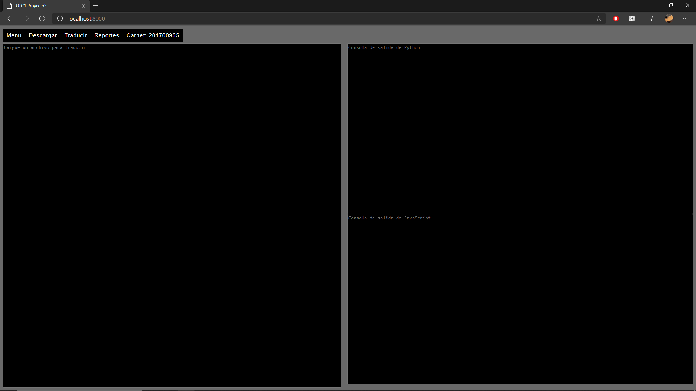
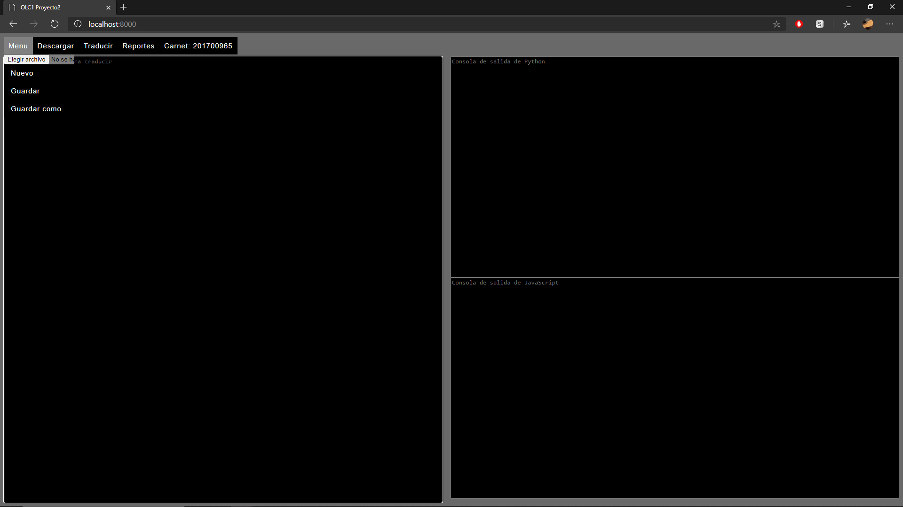
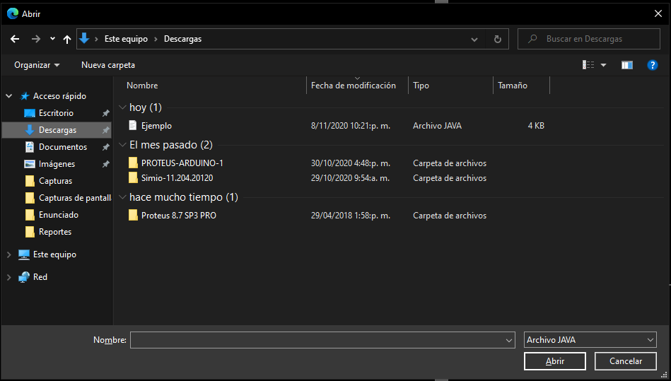
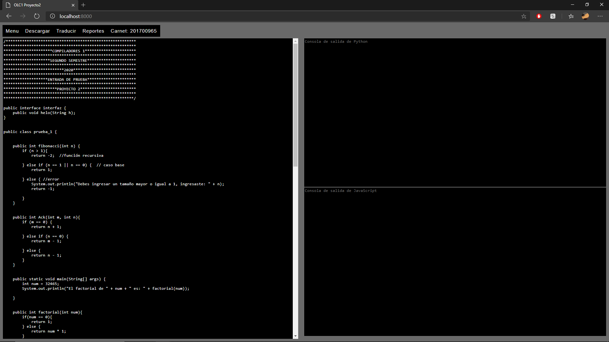
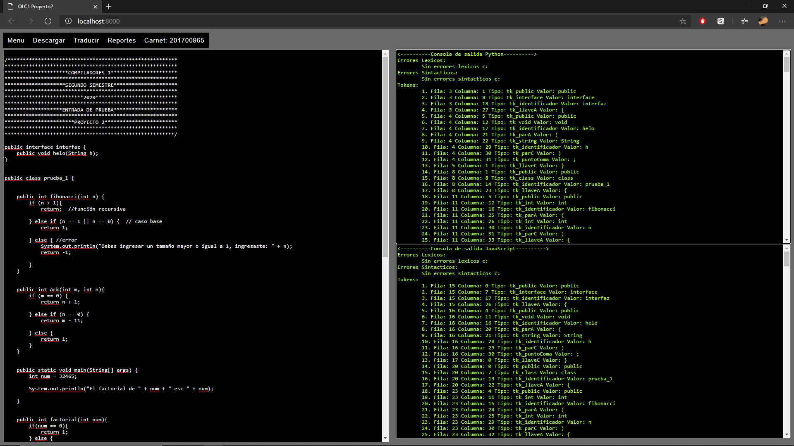
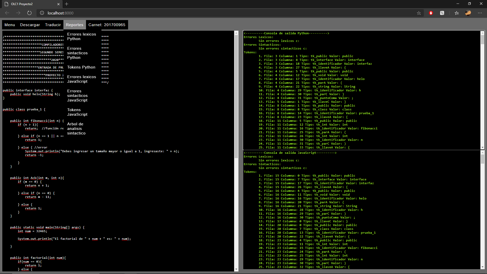

Al ingresar a la URL determinada para poder iniciar la ejecucion del aplicativo se presentara una ventana la cual contara con diferentes acciones a realizar, tales como: Subir archivo, Nuevo, Descargar traducciones (ambas o individuales), Traducir, Reportes.

Para poder dar inicio a la aplicacion debemos de cargar un archivo de entrada con extension .java el cual se puede subir en el apartado de menu, elegir archivo.
 

Al seleccionar este apartado se abrira el buscador de archivos de su ordenador para que pueda escoger el archivo que se subira para poder ser traducido

Luego de haber subido el archivo a traducir su contenido aparecera en la consola izquierda de la aplicacion, en esta consola usted puede editar el contenido del archivo subido ya que este sera el utilizado para ser traducido posteriormente

Para poder realizar la traduccion del archivo debe de seleccionar la opcion traducir, luego de realizar los analisi correspondientes obtendra el resultado del analisis en las consolas de salida tanto de la traduccion de Python como de la traduccion de JavaScript

Luego de haber realizado la traduccion los analizadores le responderan con los resultados de la traduccion mostrando los errores lexicos, sintacticos y los tokens encontrados para poder realizar la traduccion.

En el apartado de reportes podra seleccionar cualquiera de estos para poder ser visualizados de mejor manera en una nueva ventana para cada reporte seleccionado

Los archivos traducidos pueden ser descargados para esto existen tres opciones que son JavaScript que corresponde a su traduccion, Python que corresponde a su traduccion y Ambas que corresponde tanto a la traduccion de JavaScript como la de Python